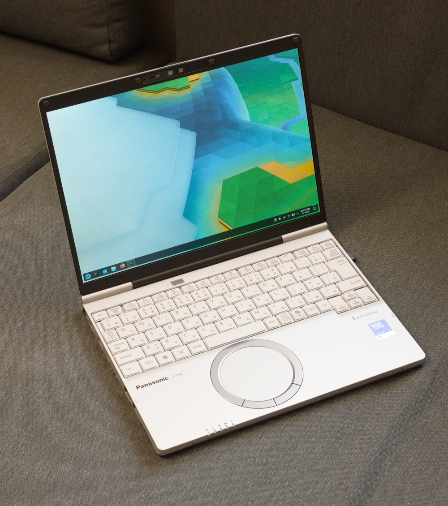

# panfan

Linux fan-control daemon for the [Panasonic CF-SC7 laptops](https://panasonic.jp/cns/pc/products/sc7a/) (`CFSC-2`)



I recently acquired a Panasonic CF-SC7A laptop during a trip to Japan as I really like its retro aesthetic paired with modern hardware. But after replacing the stock Windows with Fedora, I noticed that the fan was constantly humming at a fixed speed whereas it was completely silent at idle under Windows. Turns out that, due to some Panasonic chicanery, the fan requires custom ACPI methods to control its mode and speed. Without support for those methods, the fan remains stuck at a constant "fallback" speed, the same behavior seen in the BIOS, etc.

This is a tiny standalone C program that takes ownership of the fan and controls it based on the CPU package temperature (`x86_pkg_temp`). It comes with a sensible built-in fan policy but can also use a custom config.

Note that currently this project has only been tested on the [CF-SC7ADTCR](https://panasonic.jp/cns/pc/products/sc7a/spec.html), but in theory it should work with all laptops based on the CFSC-2 platform. **Testing and feedback from owners of other models are highly appreciated.**

## Build

```sh
make
sudo ./panfan check
```

Development checks:

```sh
make format-check
make sanitize
```

Runtime requirements are Linux, systemd, and the `acpi_call` module.

## Policy

Without `/etc/panfan.conf`, the built-in policy is:

```text
poll_interval_ms=1000
start_temp_c=45
stop_temp_c=42
emergency_temp_c=80
min_state=15
max_state=50
step_up=5
step_down=5
```

At or above the start temperature, cooling begins at `min_state` and rises by
`step_up` each poll. At or below the stop temperature, it falls by `step_down`.
Between those temperatures the state is held. The emergency temperature sets
the fan to `max_state` immediately.

Copy `panfan.conf.example` to `/etc/panfan.conf` to override any or all values.
Configuration is validated at startup; restart the service after editing it.

## Commands

```text
panfan run [CONFIG]
panfan status
panfan check [CONFIG]
panfan policy [CONFIG]
panfan passive
panfan failsafe
```

The `pre` and `post` commands are invoked by systemd through the installed
system-sleep symlink. Suspend preserves passive mode and the last fan request;
resume verifies and restores passive ownership. Other sleep operations use the
firmware-active fail-safe while asleep.

## Packages

CI builds packages for Debian 13 (`amd64`) and Fedora 44 (`x86_64`). Packages
install the daemon, systemd unit, sleep hook, modules-load configuration, and
documentation, but deliberately do not enable the daemon or disable thermald.

Debian provides `acpi-call-dkms` in its standard repositories:

```sh
sudo apt install ./panfan_0.1.0-1_amd64.deb
```

On Fedora, install `acpi_call-dkms` from a trusted external repository before
installing the RPM because it is not part of the standard Fedora repositories:

```sh
sudo dnf install ./panfan-0.1.0-1.fc44.x86_64.rpm
```

**After installation, hand control over explicitly:**

```sh
sudo systemctl mask --now thermald.service
sudo systemctl enable --now panfan.service
sudo panfan status
```

## Install from source

Do not run `panfan` alongside thermald or another program writing `TFN1`.

```sh
sudo make install
sudo modprobe acpi_call
sudo systemctl daemon-reload
sudo systemctl mask --now thermald.service
sudo systemctl enable --now panfan.service
```

Before removing or disabling `panfan`, enter the fail-safe:

```sh
sudo systemctl disable --now panfan.service
sudo panfan failsafe
sudo systemctl unmask thermald.service
sudo systemctl enable --now thermald.service
```

Package removal stops the service before deleting the executable, allowing its
`ExecStopPost` fail-safe to restore firmware-active control at maximum fan.

## Releases

Pushes and pull requests run source checks and build both package formats.
Pushing a tag matching `v$(cat VERSION)` builds binary and source packages,
checks them with `lintian` and `rpmlint`, generates checksums and provenance,
and creates a GitHub release. Update `VERSION`, `debian/changelog`, and the RPM
spec together before tagging; the workflow rejects mismatches.

## License

[MIT](LICENSE)
